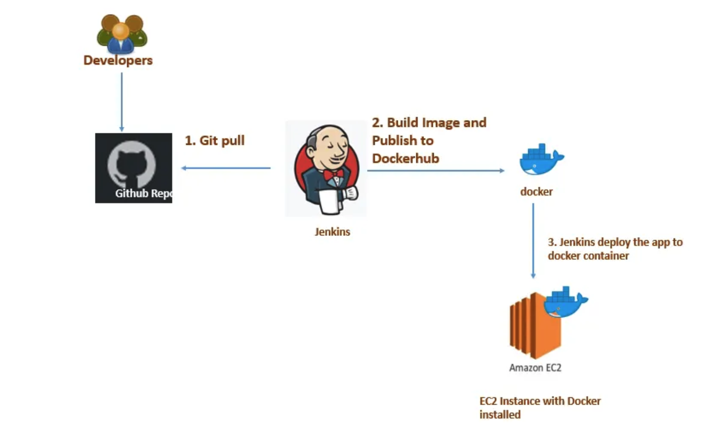
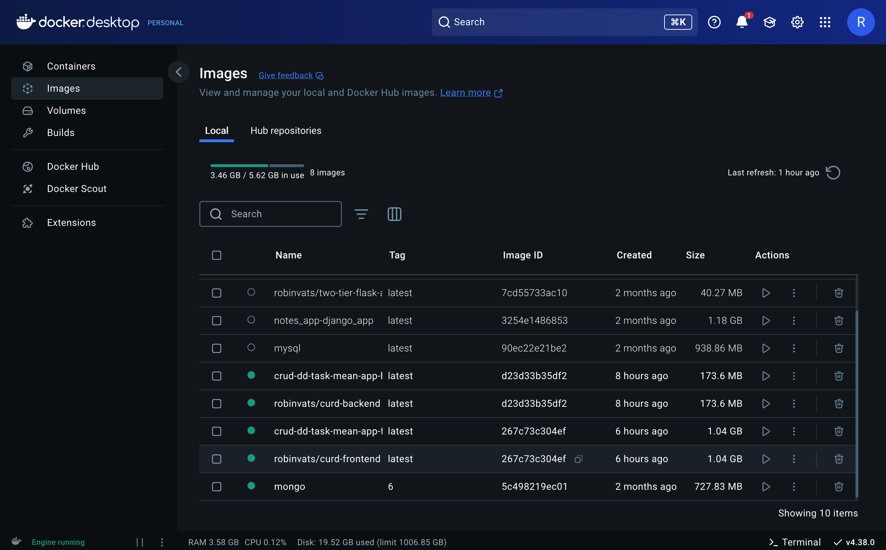
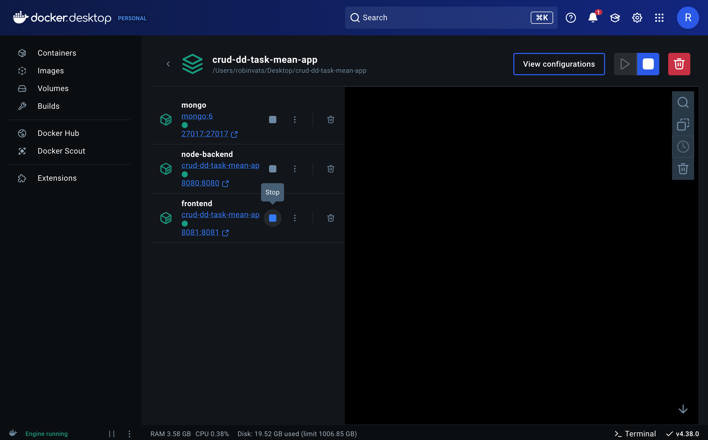
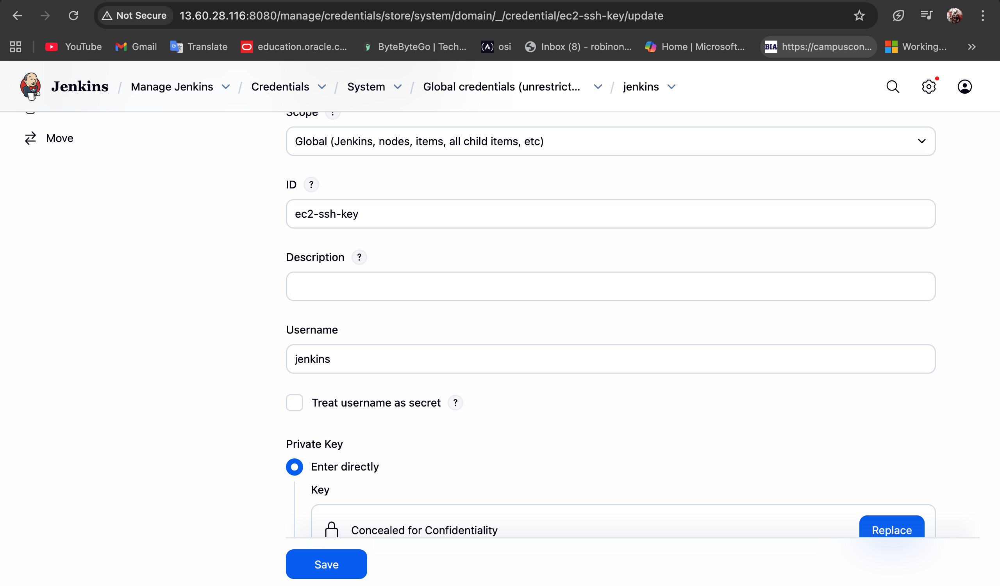
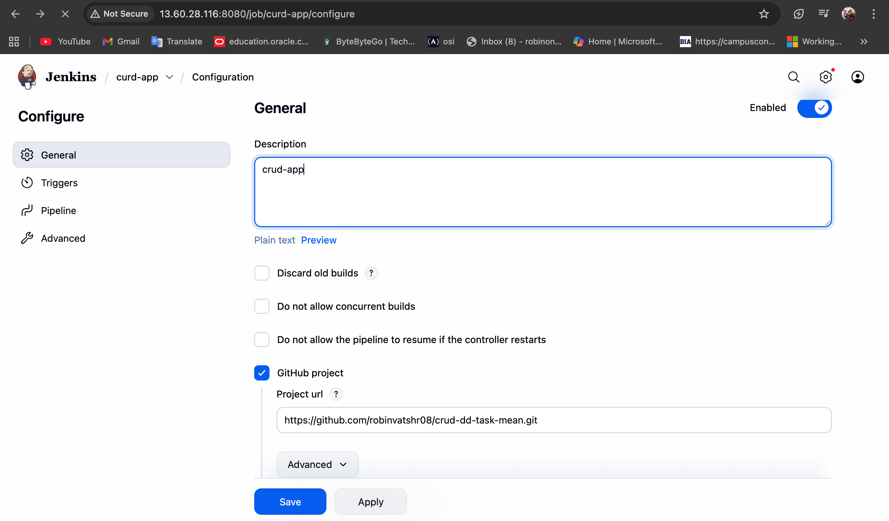
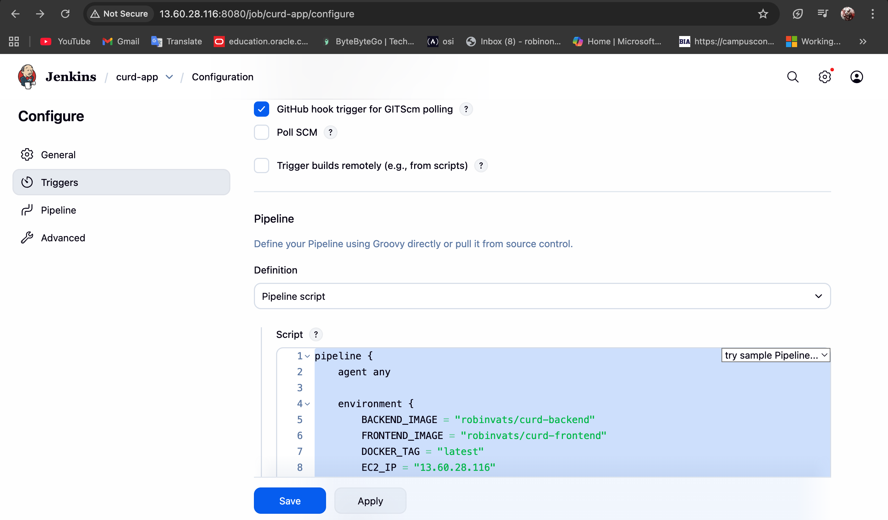
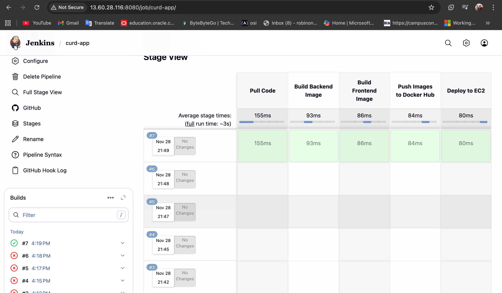
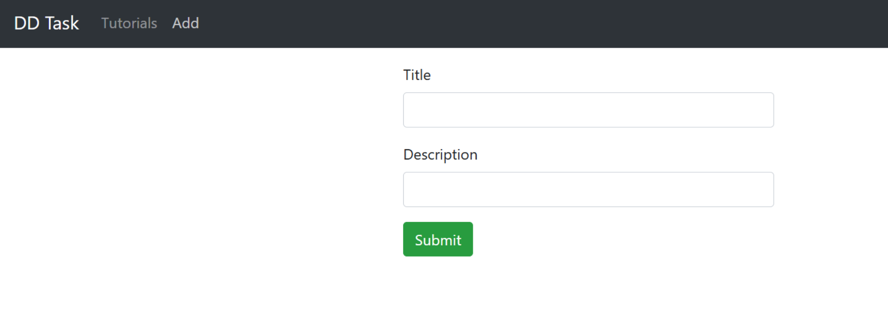

crud-dd-task-mean/
 ├── backend/
 │    ├── Dockerfile
 │    ├── package.json
 │    ├── server.js
 │    └── ...other backend files
 ├── frontend/
 │    ├── Dockerfile
 │    ├── package.json
 │    ├── angular.json
 │    └── ...other frontend files
 ├── docker-compose.yml
 ├── Jenkinsfile
 └── .env

Setup and Deployment
1. Clone the Repository
2. Create Environment Variables
3. Build Docker Images(Local testing)
4. Run with Docker Compose
5. Stop Containers
6. CI/CD Pipeline with Jenkins
    The Jenkins pipeline automates:
    Pulling latest code from GitHub
    uilding backend and frontend Docker images
    Pushing images to Docker Hub (robinvats/curd-backend & robinvats/curd-frontend)Deploying all services (MongoDB, backend, frontend, Nginx) on EC2 via Docker Compose
7. Jenkinsfile Variables:

    Variable	Description
    BACKEND_IMAGE	Docker Hub backend image
    FRONTEND_IMAGE	Docker Hub frontend image
    DOCKER_TAG	Docker image tag (latest)
    EC2_USER	EC2 SSH username (ubuntu)
    EC2_IP	Public IP of EC2 instance
    dockerhub	Jenkins credential ID for Docker Hub login
    ec2-key	Jenkins credential ID for EC2 SSH key

Project Structure

Docker images

Docker running Containers

ADD docker credentails to jenkins

ADD ec2-ssh-key credentails to jenkins

setup ci/cd pipeline through git trigger

pipeline build

final Run
